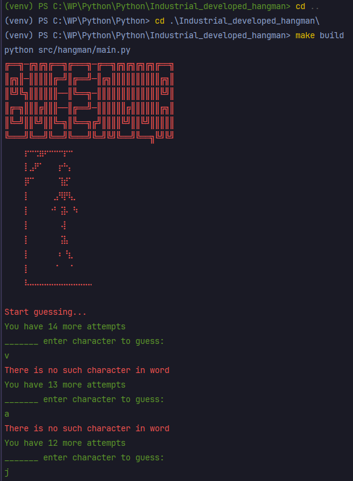

This is a simple game hangman

to install dependencies got to repository "Industrial_developed_hangman" by `cd .\Industrial_developed_hangman\` and run `make install`

to start it use `make build` command

example of programm run:

also makefile have lint command to lint source code