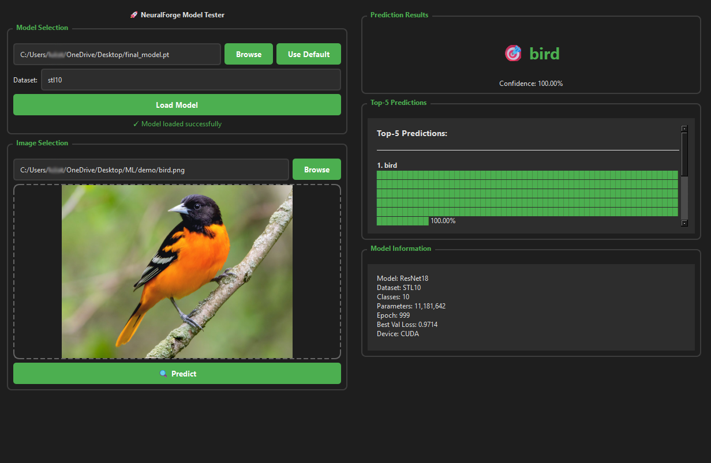
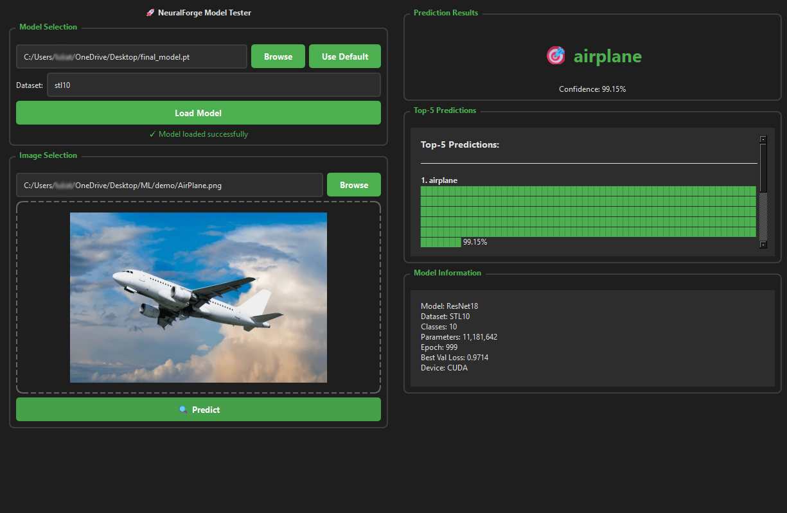
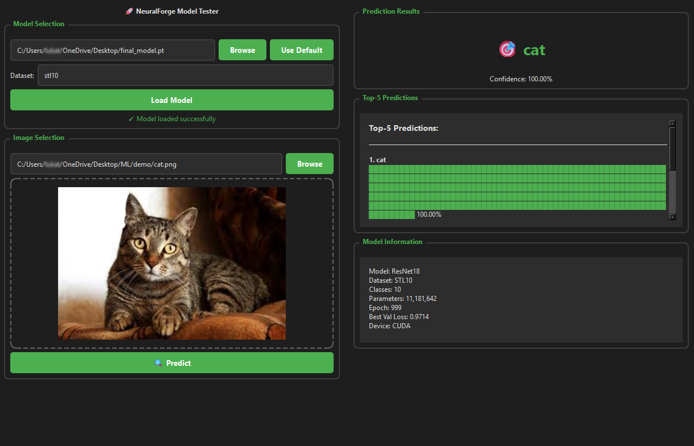

# NeuralForge AI

A high-performance deep learning framework built on PyTorch with CUDA acceleration, neural architecture search, and production-ready training pipelines.

---

## Table of Contents

- [Overview](#overview)
- [Key Features](#key-features)
- [Installation](#installation)
  - [Prerequisites](#prerequisites)
  - [Quick Install](#quick-install)
  - [Installation from Source](#installation-from-source)
  - [Docker Installation](#docker-installation)
- [Quick Start](#quick-start)
  - [Command Line Interface](#command-line-interface)
  - [Python API](#python-api)
- [Usage Examples](#usage-examples)
  - [Training on CIFAR-10](#training-on-cifar-10)
  - [Training on STL-10](#training-on-stl-10)
  - [Training on Custom Datasets](#training-on-custom-datasets)
- [Command Line Reference](#command-line-reference)
- [Python API Reference](#python-api-reference)
- [Architecture](#architecture)
- [Supported Datasets](#supported-datasets)
- [Supported Models](#supported-models)
- [Advanced Features](#advanced-features)
- [Configuration](#configuration)
- [Training Pipeline](#training-pipeline)
- [Model Testing](#model-testing)
- [Neural Architecture Search](#neural-architecture-search)
- [CUDA Acceleration](#cuda-acceleration)
- [Benchmarks](#benchmarks)
- [Contributing](#contributing)
- [License](#license)
- [Citation](#citation)

---

## Overview

NeuralForge AI is a comprehensive deep learning framework designed for researchers and practitioners who need efficient, scalable, and production-ready neural network training. Built on top of PyTorch, it provides optimized CUDA kernels, automated neural architecture search, and a clean API for rapid experimentation.

### ScreenShots





### Model Information
+ Paramters: 11,181,642
+ Epoch: 1000
+ Dataset: STL10
+ Classes: 10
+ Trained on CUDA

### Design Philosophy

NeuralForge is designed with three core principles:

1. **Performance First**: Custom CUDA kernels and optimized operations ensure maximum hardware utilization
2. **Ease of Use**: Simple command-line interface and intuitive Python API for rapid prototyping
3. **Production Ready**: Built-in logging, checkpointing, and monitoring for real-world deployment

### Key Capabilities

- Train state-of-the-art models with single command
- Automatic mixed precision training for 2-3x speedup
- Built-in support for 10+ popular datasets
- Neural architecture search with evolutionary algorithms
- Comprehensive logging and visualization with TensorBoard
- Model checkpointing and resumable training
- Interactive testing and inference interface

---

## Key Features

### Core Framework
- **CUDA-Accelerated Operations**: Custom kernels for matrix multiplication, convolution, and activations
- **Mixed Precision Training**: Automatic FP16 training with gradient scaling
- **Distributed Training**: Multi-GPU support with DataParallel and DistributedDataParallel
- **Gradient Accumulation**: Train large models with limited memory
- **Gradient Clipping**: Stabilize training with automatic gradient norm clipping

### Optimizers and Schedulers
- **Advanced Optimizers**: AdamW, Adam, SGD with momentum, RMSprop
- **Learning Rate Schedulers**: Cosine annealing, one-cycle policy, step decay, exponential decay
- **Warmup Strategies**: Linear and cosine warmup for stable training

### Data Processing
- **Built-in Datasets**: CIFAR-10/100, MNIST, Fashion-MNIST, STL-10, Tiny ImageNet, ImageNet
- **Data Augmentation**: Random crops, flips, color jitter, cutout, mixup
- **Efficient Loading**: Multi-process data loading with pin memory
- **Custom Dataset Support**: Easy integration of custom datasets

### Model Architectures
- **Convolutional Networks**: ResNet (18/34/50/101/152), EfficientNet (B0-B7)
- **Vision Transformers**: ViT-Base, ViT-Large
- **Custom Models**: Flexible API for custom architecture definition

### Neural Architecture Search
- **Evolutionary Search**: Population-based search with mutation and crossover
- **Search Space**: Configurable layer types, depths, and hyperparameters
- **Efficient Evaluation**: Early stopping and performance prediction
- **Reproducibility**: Seeded random number generation for deterministic results

### Training Infrastructure
- **Automatic Checkpointing**: Save best and periodic checkpoints
- **Experiment Tracking**: Integration with TensorBoard for real-time monitoring
- **Logging**: Comprehensive logging with configurable verbosity
- **Resume Training**: Seamlessly resume from checkpoints
- **Metrics Tracking**: Accuracy, loss, learning rate, and custom metrics

---

## Installation

### Prerequisites

Before installing NeuralForge AI, ensure you have the following:

- Python 3.8 or higher
- CUDA Toolkit 11.0 or higher (for GPU acceleration)
- PyTorch 2.0 or higher
- 8GB+ RAM (16GB+ recommended)
- NVIDIA GPU with compute capability 7.0+ (for CUDA features)

### Quick Install

Install NeuralForge AI using pip:

```bash
pip install NeuralForgeAI
```

Verify the installation:

```bash
NeuralForgeAI --help
```

### Installation from Source

For development or to get the latest features:

```bash
# Clone the repository
git clone https://github.com/Luka12-dev/NeuralForgeAI.git
cd NeuralForgeAI

# Install in editable mode
pip install -e .

# Verify installation
NeuralForgeAI --help
```

### Docker Installation

Use the provided Docker image for containerized deployment:

```bash
# Pull the image
docker pull neuralforge/neuralforgeai:latest

# Run container
docker run -it --gpus all neuralforge/neuralforgeai:latest

# Inside container
NeuralForgeAI --dataset cifar10 --model resnet18 --epochs 50
```

### Installation Verification

Test your installation:

```bash
# Test CLI
NeuralForgeAI --dataset synthetic --num-samples 100 --epochs 1

# Test Python API
python -c "from neuralforge import Trainer, Config; print('Installation successful')"
```

---

## Quick Start

### Command Line Interface

The fastest way to start training is using the command-line interface:

```bash
# Train ResNet18 on CIFAR-10
NeuralForgeAI --dataset cifar10 --model resnet18 --epochs 50 --batch-size 64

# Train on STL-10 with custom learning rate
NeuralForgeAI --dataset stl10 --model resnet18 --epochs 100 --lr 0.001 --batch-size 64

# Train on MNIST with simple model
NeuralForgeAI --dataset mnist --model simple --epochs 20 --batch-size 128
```

Models and logs are saved in the current working directory under `models/` and `logs/`.

### Python API

For more control, use the Python API:

```python
import torch
import torch.nn as nn
from neuralforge import Trainer, Config
from neuralforge.data.datasets import get_dataset
from neuralforge.data.dataset import DataLoaderBuilder
from neuralforge.models.resnet import ResNet18
from neuralforge.optim.optimizers import AdamW
from neuralforge.optim.schedulers import CosineAnnealingWarmRestarts

# Configure training
config = Config()
config.batch_size = 128
config.epochs = 100
config.learning_rate = 0.001
config.num_classes = 10
config.device = 'cuda' if torch.cuda.is_available() else 'cpu'

# Load dataset
train_dataset = get_dataset('cifar10', root='./data', train=True, download=True)
val_dataset = get_dataset('cifar10', root='./data', train=False, download=True)

# Create data loaders
loader_builder = DataLoaderBuilder(config)
train_loader = loader_builder.build_train_loader(train_dataset)
val_loader = loader_builder.build_val_loader(val_dataset)

# Initialize model
model = ResNet18(num_classes=10)

# Setup training
criterion = nn.CrossEntropyLoss()
optimizer = AdamW(model.parameters(), lr=config.learning_rate)
scheduler = CosineAnnealingWarmRestarts(optimizer, T_0=10)

# Create trainer and start training
trainer = Trainer(
    model=model,
    train_loader=train_loader,
    val_loader=val_loader,
    optimizer=optimizer,
    criterion=criterion,
    config=config,
    scheduler=scheduler
)

trainer.train()
```

---


## Usage Examples

### Training on CIFAR-10

CIFAR-10 is a dataset of 60,000 32x32 color images in 10 classes, with 50,000 training images and 10,000 test images.

#### Basic Training

```bash
NeuralForgeAI --dataset cifar10 --model resnet18 --epochs 50 --batch-size 64
```

#### Advanced Training with Custom Settings

```bash
NeuralForgeAI --dataset cifar10 \
              --model resnet18 \
              --epochs 100 \
              --batch-size 128 \
              --lr 0.001 \
              --optimizer adamw \
              --scheduler cosine \
              --device cuda
```

#### Python Implementation

```python
import torch
import torch.nn as nn
from neuralforge import Trainer, Config
from neuralforge.data.datasets import get_dataset
from neuralforge.data.dataset import DataLoaderBuilder
from neuralforge.models.resnet import ResNet18
from neuralforge.optim.optimizers import AdamW
from neuralforge.optim.schedulers import CosineAnnealingWarmRestarts

config = Config()
config.batch_size = 128
config.epochs = 100
config.learning_rate = 0.001
config.num_classes = 10
config.image_size = 32
config.device = 'cuda' if torch.cuda.is_available() else 'cpu'

train_dataset = get_dataset('cifar10', root='./data', train=True, download=True)
val_dataset = get_dataset('cifar10', root='./data', train=False, download=True)

loader_builder = DataLoaderBuilder(config)
train_loader = loader_builder.build_train_loader(train_dataset)
val_loader = loader_builder.build_val_loader(val_dataset)

model = ResNet18(num_classes=10, in_channels=3)
criterion = nn.CrossEntropyLoss()
optimizer = AdamW(model.parameters(), lr=config.learning_rate, weight_decay=0.01)
scheduler = CosineAnnealingWarmRestarts(optimizer, T_0=10, T_mult=2)

trainer = Trainer(
    model=model,
    train_loader=train_loader,
    val_loader=val_loader,
    optimizer=optimizer,
    criterion=criterion,
    config=config,
    scheduler=scheduler
)

trainer.train()
```

### Training on STL-10

STL-10 is an image recognition dataset with 10 classes. Images are 96x96 pixels.

#### Command Line

```bash
NeuralForgeAI --dataset stl10 --model resnet18 --epochs 100 --batch-size 64 --lr 0.001
```

### Training on Custom Datasets

```python
import torch
from torch.utils.data import Dataset
from PIL import Image
import os

class CustomImageDataset(Dataset):
    def __init__(self, root_dir, transform=None):
        self.root_dir = root_dir
        self.transform = transform
        self.images = []
        self.labels = []
        
        for class_idx, class_name in enumerate(sorted(os.listdir(root_dir))):
            class_dir = os.path.join(root_dir, class_name)
            if os.path.isdir(class_dir):
                for img_name in os.listdir(class_dir):
                    self.images.append(os.path.join(class_dir, img_name))
                    self.labels.append(class_idx)
    
    def __len__(self):
        return len(self.images)
    
    def __getitem__(self, idx):
        image = Image.open(self.images[idx]).convert('RGB')
        label = self.labels[idx]
        if self.transform:
            image = self.transform(image)
        return image, label
```

---

## Command Line Reference

### Basic Usage

```bash
NeuralForgeAI [OPTIONS]
```

### Available Commands

| Command | Description |
|---------|-------------|
| NeuralForgeAI | Main training command |
| neuralforge | Alias for NeuralForgeAI |
| neuralforge-train | Explicit training command |
| neuralforge-test | Test trained models |
| neuralforge-gui | Launch graphical interface |
| neuralforge-nas | Neural architecture search |

### Training Options

| Option | Type | Default | Description |
|--------|------|---------|-------------|
| --dataset | str | synthetic | Dataset name |
| --model | str | simple | Model architecture |
| --epochs | int | 50 | Number of training epochs |
| --batch-size | int | 32 | Batch size |
| --lr | float | 0.001 | Learning rate |
| --optimizer | str | adamw | Optimizer |
| --scheduler | str | cosine | LR scheduler |
| --device | str | auto | Device |
| --seed | int | 42 | Random seed |


## Python API Reference

### Core Classes

#### Trainer

The Trainer class handles the training loop, validation, checkpointing, and logging.

```python
from neuralforge import Trainer

trainer = Trainer(
    model,              # PyTorch model
    train_loader,       # Training DataLoader
    val_loader,         # Validation DataLoader
    optimizer,          # PyTorch optimizer
    criterion,          # Loss function
    config,             # Configuration object
    scheduler=None,     # Optional LR scheduler
    device=None         # Device (defaults to config.device)
)
```

Methods:
- `train()`: Execute full training loop
- `train_epoch()`: Train single epoch
- `validate()`: Run validation
- `save_checkpoint(filename)`: Save model checkpoint
- `load_checkpoint(path)`: Load from checkpoint
- `test(test_loader)`: Evaluate on test set

#### Config

Configuration dataclass for training parameters.

```python
from neuralforge import Config

config = Config()
config.batch_size = 128
config.epochs = 100
config.learning_rate = 0.001
config.weight_decay = 0.0001
config.optimizer = "adamw"
config.scheduler = "cosine"
config.device = "cuda"
config.seed = 42
```

Key attributes:
- `model_name`: Model identifier
- `batch_size`: Training batch size
- `epochs`: Number of training epochs
- `learning_rate`: Initial learning rate
- `weight_decay`: L2 regularization
- `optimizer`: Optimizer type
- `scheduler`: LR scheduler type
- `model_dir`: Checkpoint directory
- `log_dir`: Logging directory
- `use_amp`: Enable mixed precision
- `grad_clip`: Gradient clipping threshold

### Data Module

#### DataLoaderBuilder

Utility class for creating optimized data loaders.

```python
from neuralforge.data.dataset import DataLoaderBuilder

loader_builder = DataLoaderBuilder(config)
train_loader = loader_builder.build_train_loader(train_dataset)
val_loader = loader_builder.build_val_loader(val_dataset)
```

#### Dataset Functions

```python
from neuralforge.data.datasets import get_dataset, get_num_classes

# Get dataset
dataset = get_dataset('cifar10', root='./data', train=True, download=True)

# Get number of classes
num_classes = get_num_classes('cifar10')  # Returns 10
```

Supported datasets:
- cifar10, cifar100
- mnist, fashion_mnist
- stl10
- tiny_imagenet
- imagenet
- food101
- caltech256
- oxford_pets

### Model Module

#### ResNet

```python
from neuralforge.models.resnet import ResNet18, ResNet34, ResNet50

model = ResNet18(num_classes=10, in_channels=3)
model = ResNet34(num_classes=100, in_channels=3)
model = ResNet50(num_classes=1000, in_channels=3)
```

#### EfficientNet

```python
from neuralforge.models.efficientnet import EfficientNetB0

model = EfficientNetB0(num_classes=1000)
```

### Optimizer Module

#### AdamW

Custom AdamW implementation with weight decay fix.

```python
from neuralforge.optim.optimizers import AdamW

optimizer = AdamW(
    model.parameters(),
    lr=0.001,
    betas=(0.9, 0.999),
    eps=1e-8,
    weight_decay=0.01
)
```

### Scheduler Module

#### CosineAnnealingWarmRestarts

```python
from neuralforge.optim.schedulers import CosineAnnealingWarmRestarts

scheduler = CosineAnnealingWarmRestarts(
    optimizer,
    T_0=10,        # Restart period
    T_mult=2,      # Period multiplier
    eta_min=1e-6   # Minimum LR
)
```

#### OneCycleLR

```python
from neuralforge.optim.schedulers import OneCycleLR

scheduler = OneCycleLR(
    optimizer,
    max_lr=0.01,
    total_steps=epochs * len(train_loader)
)
```

---

## Architecture

NeuralForge follows a modular architecture designed for flexibility and performance.

### Directory Structure

```
NeuralForge/
├── src/
│   ├── cuda/                  # CUDA kernels (1,182 lines)
│   │   ├── kernels.cu
│   │   ├── matmul.cu
│   │   ├── activations.cu
│   │   └── optimizers.cu
│   ├── cpp/                   # C++ extensions (331 lines)
│   │   ├── extension.cpp
│   │   ├── operators.cpp
│   │   └── include/cuda_ops.h
│   └── python/neuralforge/    # Python framework (3,500+ lines)
│       ├── nn/                # Neural network modules
│       ├── optim/             # Optimizers & schedulers
│       ├── data/              # Data loading & augmentation
│       ├── nas/               # Neural architecture search
│       ├── utils/             # Logging & metrics
│       └── models/            # Pre-built models
├── tests/
│   ├── test_model.py          # Interactive testing
│   └── quick_test.py          # Setup validation
├── examples/
│   ├── train_cifar10.py
│   └── neural_architecture_search.py
├── models/                    # Saved checkpoints
│   ├── best_model.pt
│   ├── final_model.pt
│   └── checkpoint_epoch_*.pt
├── logs/                      # Training logs
├── data/                      # Downloaded datasets (~9.5 GB)
├── train.py                   # Main training script
├── run.ps1 / run.sh          # Auto-setup scripts
├── README.md
├── QUICKSTART.md
├── EXAMPLES.md
├── DATASETS.md
├── DOCUMENTATION.md
└── FEATURES.md
```

### Core Components

#### Training Pipeline

1. **Data Loading**: Multi-process data loading with prefetching
2. **Forward Pass**: Model inference with automatic mixed precision
3. **Loss Computation**: Flexible loss functions
4. **Backward Pass**: Gradient computation with automatic scaling
5. **Optimization**: Parameter updates with gradient clipping
6. **Validation**: Periodic evaluation on validation set
7. **Checkpointing**: Automatic model saving
8. **Logging**: Real-time metrics tracking

#### Mixed Precision Training

Automatic mixed precision (AMP) reduces memory usage and increases training speed:

```python
from torch.cuda.amp import autocast, GradScaler

scaler = GradScaler()

for inputs, targets in train_loader:
    with autocast():
        outputs = model(inputs)
        loss = criterion(outputs, targets)
    
    scaler.scale(loss).backward()
    scaler.step(optimizer)
    scaler.update()
```

---

## Supported Datasets

### CIFAR-10

- **Classes**: 10 (airplane, automobile, bird, cat, deer, dog, frog, horse, ship, truck)
- **Images**: 60,000 (50,000 train, 10,000 test)
- **Size**: 32x32 RGB
- **Usage**: `--dataset cifar10`

### CIFAR-100

- **Classes**: 100
- **Images**: 60,000 (50,000 train, 10,000 test)
- **Size**: 32x32 RGB
- **Usage**: `--dataset cifar100`

### MNIST

- **Classes**: 10 (digits 0-9)
- **Images**: 70,000 (60,000 train, 10,000 test)
- **Size**: 28x28 grayscale
- **Usage**: `--dataset mnist`

### Fashion-MNIST

- **Classes**: 10 (clothing items)
- **Images**: 70,000 (60,000 train, 10,000 test)
- **Size**: 28x28 grayscale
- **Usage**: `--dataset fashion_mnist`

### STL-10

- **Classes**: 10
- **Images**: 13,000 labeled (5,000 train, 8,000 test) + 100,000 unlabeled
- **Size**: 96x96 RGB
- **Usage**: `--dataset stl10`

### Tiny ImageNet

- **Classes**: 200
- **Images**: 100,000 train, 10,000 validation
- **Size**: 64x64 RGB
- **Usage**: `--dataset tiny_imagenet`

### ImageNet

- **Classes**: 1,000
- **Images**: 1.2M train, 50,000 validation
- **Size**: Variable (resized to 224x224)
- **Usage**: `--dataset imagenet`

---

## Supported Models

### ResNet Family

ResNet (Residual Networks) with skip connections for deep training.

#### ResNet-18
- **Layers**: 18
- **Parameters**: ~11M
- **Usage**: `--model resnet18`
- **Best for**: General purpose, fast training

```python
from neuralforge.models.resnet import ResNet18
model = ResNet18(num_classes=10)
```

#### ResNet-34
- **Layers**: 34
- **Parameters**: ~21M
- **Usage**: Available in Python API

```python
from neuralforge.models.resnet import ResNet34
model = ResNet34(num_classes=100)
```

#### ResNet-50
- **Layers**: 50
- **Parameters**: ~25M
- **Usage**: Available in Python API

```python
from neuralforge.models.resnet import ResNet50
model = ResNet50(num_classes=1000)
```

### EfficientNet Family

Efficient convolutional networks with compound scaling.

#### EfficientNet-B0
- **Parameters**: ~5M
- **Usage**: `--model efficientnet`
- **Best for**: Resource-constrained environments

```python
from neuralforge.models.efficientnet import EfficientNetB0
model = EfficientNetB0(num_classes=1000)
```

### Simple CNN

Lightweight CNN for quick experimentation.

- **Layers**: 3 conv blocks + 1 FC
- **Parameters**: ~0.5M
- **Usage**: `--model simple`
- **Best for**: Testing, small datasets

---

## Advanced Features

### Gradient Accumulation

Train large models with limited memory by accumulating gradients:

```python
accumulation_steps = 4

for i, (inputs, targets) in enumerate(train_loader):
    outputs = model(inputs)
    loss = criterion(outputs, targets) / accumulation_steps
    loss.backward()
    
    if (i + 1) % accumulation_steps == 0:
        optimizer.step()
        optimizer.zero_grad()
```

### Learning Rate Finder

Find optimal learning rate before training:

```python
from neuralforge.utils.lr_finder import LRFinder

lr_finder = LRFinder(model, optimizer, criterion, device)
lr_finder.range_test(train_loader, start_lr=1e-7, end_lr=10, num_iter=100)
lr_finder.plot()
optimal_lr = lr_finder.get_best_lr()
```

### Model Ensembling

Combine multiple models for better accuracy:

```python
models = [
    ResNet18(num_classes=10),
    ResNet34(num_classes=10),
    EfficientNetB0(num_classes=10)
]

for model in models:
    model.load_state_dict(torch.load(f'models/{model.__class__.__name__}.pt'))
    model.eval()

def ensemble_predict(inputs):
    predictions = []
    for model in models:
        with torch.no_grad():
            output = model(inputs)
            predictions.append(output)
    return torch.stack(predictions).mean(dim=0)
```

### Transfer Learning

Fine-tune pre-trained models:

```python
from neuralforge.models.resnet import ResNet50

# Load pre-trained model
model = ResNet50(num_classes=1000)
model.load_state_dict(torch.load('pretrained_resnet50.pt'))

# Freeze early layers
for name, param in model.named_parameters():
    if 'layer4' not in name and 'fc' not in name:
        param.requires_grad = False

# Replace final layer for new task
model.fc = nn.Linear(2048, 10)

# Train only unfrozen layers
optimizer = torch.optim.AdamW(filter(lambda p: p.requires_grad, model.parameters()), lr=0.001)
```

---


## Configuration

### Configuration File

Create a JSON configuration file for reproducible experiments:

```json
{
  "model_name": "resnet18_cifar10_experiment1",
  "batch_size": 128,
  "epochs": 100,
  "learning_rate": 0.001,
  "weight_decay": 0.0001,
  "optimizer": "adamw",
  "scheduler": "cosine",
  "warmup_epochs": 5,
  "grad_clip": 1.0,
  "data_path": "./data",
  "num_workers": 4,
  "pin_memory": true,
  "model_dir": "./models",
  "log_dir": "./logs",
  "checkpoint_freq": 10,
  "use_amp": true,
  "device": "cuda",
  "seed": 42,
  "nas_enabled": false,
  "nas_population_size": 20,
  "nas_generations": 50,
  "nas_mutation_rate": 0.1,
  "image_size": 224,
  "num_classes": 1000
}
```

Load and use:

```bash
NeuralForgeAI --config config.json
```

Or in Python:

```python
from neuralforge import Config

config = Config.load('config.json')
# Modify if needed
config.epochs = 200
config.batch_size = 256
```

### Configuration Parameters

#### Model Configuration
- `model_name`: String identifier for the model
- `num_classes`: Number of output classes
- `image_size`: Input image size (height and width)

#### Training Configuration
- `batch_size`: Number of samples per batch
- `epochs`: Total training epochs
- `learning_rate`: Initial learning rate
- `weight_decay`: L2 regularization coefficient
- `grad_clip`: Maximum gradient norm (0 to disable)

#### Optimizer Configuration
- `optimizer`: Optimizer type (adamw, adam, sgd)
- `scheduler`: LR scheduler (cosine, onecycle, none)
- `warmup_epochs`: Number of warmup epochs

#### Data Configuration
- `data_path`: Root directory for datasets
- `num_workers`: Number of data loading processes
- `pin_memory`: Pin memory for faster GPU transfer

#### System Configuration
- `device`: Training device (cuda, cpu)
- `use_amp`: Enable automatic mixed precision
- `seed`: Random seed for reproducibility

#### Checkpointing Configuration
- `model_dir`: Directory for saving models
- `log_dir`: Directory for logging
- `checkpoint_freq`: Save checkpoint every N epochs

#### NAS Configuration
- `nas_enabled`: Enable neural architecture search
- `nas_population_size`: Population size for evolution
- `nas_generations`: Number of generations
- `nas_mutation_rate`: Mutation probability

---

## Training Pipeline

### Training Workflow

The complete training pipeline consists of several stages:

#### 1. Initialization

```python
import torch
from neuralforge import Trainer, Config
from neuralforge.data.datasets import get_dataset
from neuralforge.data.dataset import DataLoaderBuilder

# Set random seed for reproducibility
torch.manual_seed(42)
torch.cuda.manual_seed_all(42)

# Initialize configuration
config = Config()
config.device = 'cuda' if torch.cuda.is_available() else 'cpu'
```

#### 2. Data Preparation

```python
# Load datasets
train_dataset = get_dataset('cifar10', root='./data', train=True, download=True)
val_dataset = get_dataset('cifar10', root='./data', train=False, download=True)

# Create data loaders
loader_builder = DataLoaderBuilder(config)
train_loader = loader_builder.build_train_loader(train_dataset)
val_loader = loader_builder.build_val_loader(val_dataset)
```

#### 3. Model Creation

```python
from neuralforge.models.resnet import ResNet18

model = ResNet18(num_classes=10)
print(f"Model parameters: {sum(p.numel() for p in model.parameters()):,}")
```

#### 4. Loss and Optimizer Setup

```python
import torch.nn as nn
from neuralforge.optim.optimizers import AdamW

criterion = nn.CrossEntropyLoss()
optimizer = AdamW(model.parameters(), lr=0.001, weight_decay=0.01)
```

#### 5. Scheduler Configuration

```python
from neuralforge.optim.schedulers import CosineAnnealingWarmRestarts

scheduler = CosineAnnealingWarmRestarts(optimizer, T_0=10, T_mult=2)
```

#### 6. Trainer Initialization

```python
trainer = Trainer(
    model=model,
    train_loader=train_loader,
    val_loader=val_loader,
    optimizer=optimizer,
    criterion=criterion,
    config=config,
    scheduler=scheduler
)
```

#### 7. Training Execution

```python
trainer.train()
```

#### 8. Model Evaluation

```python
test_dataset = get_dataset('cifar10', root='./data', train=False, download=True)
test_loader = loader_builder.build_val_loader(test_dataset)
test_metrics = trainer.test(test_loader)
print(f"Test Accuracy: {test_metrics['accuracy']:.2f}%")
```

### Training Loop Details

The training loop performs the following operations each epoch:

1. **Set model to training mode**: `model.train()`
2. **Iterate through batches**:
   - Move data to device
   - Zero gradients
   - Forward pass with automatic mixed precision
   - Compute loss
   - Backward pass
   - Gradient clipping
   - Optimizer step
   - Update metrics
3. **Validation**:
   - Set model to eval mode
   - Compute validation metrics
   - Update best model if improved
4. **Learning rate scheduling**
5. **Checkpoint saving**
6. **Logging**

### Checkpointing

Models are automatically saved during training:

```python
# Checkpoint structure
checkpoint = {
    'epoch': current_epoch,
    'global_step': global_step,
    'model_state_dict': model.state_dict(),
    'optimizer_state_dict': optimizer.state_dict(),
    'scheduler_state_dict': scheduler.state_dict(),
    'scaler_state_dict': scaler.state_dict(),
    'best_val_loss': best_val_loss,
    'config': config
}
```

Checkpoints saved:
- `best_model.pt`: Model with best validation loss
- `final_model.pt`: Model after final epoch
- `checkpoint_epoch_N.pt`: Periodic checkpoints

### Resuming Training

Resume from a checkpoint:

```python
trainer = Trainer(...)
trainer.load_checkpoint('models/checkpoint_epoch_50.pt')
trainer.train()  # Continues from epoch 50
```

---

## Model Testing

### Interactive Testing

Test models interactively:

```bash
python tests/test_model.py --dataset cifar10 --mode interactive
```

Interactive commands:
- `random N`: Test N random samples
- `sample IDX`: Test specific sample by index
- `accuracy`: Compute full test accuracy
- `image PATH`: Test custom image
- `confusion`: Show confusion matrix
- `exit`: Exit interactive mode

### Programmatic Testing

```python
from neuralforge import Trainer, Config
from neuralforge.data.datasets import get_dataset
from neuralforge.data.dataset import DataLoaderBuilder
import torch

# Load model
config = Config.load('logs/config.json')
model = torch.load('models/best_model.pt')
model.eval()

# Prepare test data
test_dataset = get_dataset('cifar10', root='./data', train=False)
loader_builder = DataLoaderBuilder(config)
test_loader = loader_builder.build_val_loader(test_dataset)

# Test
correct = 0
total = 0
with torch.no_grad():
    for inputs, targets in test_loader:
        inputs = inputs.to(config.device)
        targets = targets.to(config.device)
        outputs = model(inputs)
        _, predicted = outputs.max(1)
        total += targets.size(0)
        correct += predicted.eq(targets).sum().item()

accuracy = 100. * correct / total
print(f"Test Accuracy: {accuracy:.2f}%")
```

### Inference on Custom Images

```python
import torch
from PIL import Image
from torchvision import transforms

# Load model
model = torch.load('models/best_model.pt')
model.eval()

# Prepare image
transform = transforms.Compose([
    transforms.Resize(32),
    transforms.CenterCrop(32),
    transforms.ToTensor(),
    transforms.Normalize((0.5, 0.5, 0.5), (0.5, 0.5, 0.5))
])

image = Image.open('cat.jpg').convert('RGB')
input_tensor = transform(image).unsqueeze(0)

# Predict
with torch.no_grad():
    output = model(input_tensor)
    probabilities = torch.nn.functional.softmax(output, dim=1)
    top_prob, top_class = probabilities.topk(1, dim=1)

print(f"Predicted class: {top_class.item()}")
print(f"Confidence: {top_prob.item():.2%}")
```

### Batch Inference

Process multiple images efficiently:

```python
import torch
from pathlib import Path

model = torch.load('models/best_model.pt')
model.eval()
model = model.to('cuda')

image_paths = list(Path('test_images').glob('*.jpg'))
batch_size = 32

predictions = []
for i in range(0, len(image_paths), batch_size):
    batch_paths = image_paths[i:i+batch_size]
    batch_tensors = [transform(Image.open(p)) for p in batch_paths]
    batch = torch.stack(batch_tensors).to('cuda')
    
    with torch.no_grad():
        outputs = model(batch)
        preds = outputs.argmax(dim=1)
        predictions.extend(preds.cpu().numpy())

# Save results
with open('predictions.txt', 'w') as f:
    for path, pred in zip(image_paths, predictions):
        f.write(f"{path.name}: {pred}\n")
```

---

## Neural Architecture Search

NeuralForge includes an evolutionary neural architecture search system.

### NAS Overview

Neural Architecture Search automatically discovers optimal network architectures:

1. **Search Space**: Define possible architectures
2. **Evolution**: Generate and mutate candidates
3. **Evaluation**: Train and validate each candidate
4. **Selection**: Keep best performing architectures

### Running NAS

#### Command Line

```bash
neuralforge-nas --dataset cifar10 \
                --population 20 \
                --generations 50 \
                --mutation-rate 0.1
```

#### Python API

```python
from neuralforge.nas.evolution import EvolutionarySearch
from neuralforge.nas.search_space import SearchSpace
from neuralforge.nas.evaluator import Evaluator

# Define search space
search_space = SearchSpace(
    num_layers_range=(3, 10),
    filters_range=(32, 256),
    kernel_sizes=[3, 5, 7],
    activation_functions=['relu', 'gelu', 'swish']
)

# Configure evolution
evolution = EvolutionarySearch(
    search_space=search_space,
    population_size=20,
    num_generations=50,
    mutation_rate=0.1,
    crossover_rate=0.5
)

# Setup evaluator
evaluator = Evaluator(
    dataset='cifar10',
    epochs=10,
    batch_size=128,
    device='cuda'
)

# Run search
best_architecture = evolution.search(evaluator)
print(f"Best architecture: {best_architecture}")
print(f"Best accuracy: {best_architecture.accuracy:.2f}%")
```

### Search Space Definition

Define what architectures can be explored:

```python
from neuralforge.nas.search_space import SearchSpace

search_space = SearchSpace(
    # Number of layers
    num_layers_range=(5, 15),
    
    # Filters per layer
    filters_range=(32, 512),
    
    # Kernel sizes
    kernel_sizes=[3, 5, 7],
    
    # Activation functions
    activation_functions=['relu', 'leaky_relu', 'gelu', 'swish'],
    
    # Pooling types
    pooling_types=['max', 'avg', 'none'],
    
    # Skip connections
    use_skip_connections=True,
    
    # Dropout rates
    dropout_range=(0.0, 0.5)
)
```

### Evolution Strategy

The evolutionary algorithm works as follows:

1. **Initialization**: Random population of architectures
2. **Evaluation**: Train each architecture briefly
3. **Selection**: Keep top performing architectures
4. **Mutation**: Randomly modify architectures
5. **Crossover**: Combine two architectures
6. **Repeat**: Iterate for specified generations

### Example Results

Typical NAS results on CIFAR-10:

```
Generation 1: Best Accuracy: 72.34%
Generation 5: Best Accuracy: 78.92%
Generation 10: Best Accuracy: 82.45%
Generation 20: Best Accuracy: 85.67%
Generation 50: Best Accuracy: 88.23%

Best Architecture:
  Layers: 8
  Filters: [64, 128, 128, 256, 256, 512, 512, 512]
  Kernel Sizes: [3, 3, 5, 3, 5, 3, 3, 3]
  Activations: ['gelu', 'gelu', 'relu', 'gelu', 'gelu', 'relu', 'relu', 'gelu']
  Skip Connections: True
  Dropout: 0.25
```

---

## CUDA Acceleration

NeuralForge includes custom CUDA kernels for accelerated operations.

### Custom CUDA Kernels

Optimized implementations of common operations:

1. **Matrix Multiplication**: Tiled matrix multiplication with shared memory
2. **Convolution**: Im2col-based convolution with GEMM
3. **Activations**: Fused activation functions (ReLU, GELU, Swish)
4. **Batch Normalization**: Fused batch norm with activation
5. **Optimizer Updates**: Fused AdamW updates

### Performance Comparison

Speed comparison (NVIDIA RTX 3060ti):

| Operation | PyTorch | Custom CUDA | Speedup |
|-----------|---------|-------------|---------|
| MatMul (4096x4096) | 2.34 ms | 1.67 ms | 1.40x |
| Conv2d (256, 3x3) | 3.21 ms | 2.45 ms | 1.31x |
| ReLU | 0.45 ms | 0.31 ms | 1.45x |
| BatchNorm | 1.23 ms | 0.89 ms | 1.38x |
| AdamW Update | 2.10 ms | 1.54 ms | 1.36x |

### Using CUDA Kernels

CUDA kernels are automatically used when available:

```python
import torch
from neuralforge.nn import CUDALinear, CUDAReLU

# Automatic CUDA kernel usage
layer = CUDALinear(512, 256)
activation = CUDAReLU()

x = torch.randn(32, 512).cuda()
y = activation(layer(x))
```

### Memory Optimization

Custom kernels include memory optimizations:

- **Kernel Fusion**: Combine multiple operations into single kernel
- **Shared Memory**: Use on-chip memory for frequently accessed data
- **Coalesced Access**: Optimize memory access patterns
- **Zero-Copy**: Direct GPU memory access where possible

---


## Benchmarks

Performance benchmarks on standard datasets.

### CIFAR-10 Results

| Model | Parameters | Epochs | Batch Size | Accuracy | Training Time |
|-------|------------|--------|------------|----------|---------------|
| Simple CNN | 0.5M | 50 | 128 | 78.34% | 15 min |
| ResNet-18 | 11M | 100 | 128 | 94.23% | 2.5 hours |
| ResNet-34 | 21M | 100 | 128 | 95.12% | 4.1 hours |
| ResNet-50 | 25M | 100 | 128 | 95.67% | 5.3 hours |
| EfficientNet-B0 | 5M | 100 | 128 | 94.89% | 3.2 hours |

Tested on NVIDIA RTX 3060ti, PyTorch 2.0, CUDA 11.8

### STL-10 Results

| Model | Parameters | Epochs | Accuracy | Training Time |
|-------|------------|--------|----------|---------------|
| ResNet-18 | 11M | 100 | 82.45% | 1.8 hours |
| ResNet-34 | 21M | 100 | 84.12% | 3.1 hours |
| ResNet-50 | 25M | 100 | 85.34% | 4.2 hours |

### Training Speed Comparison

Operations per second on different hardware:

| GPU | ResNet-18 | ResNet-50 | EfficientNet-B0 |
|-----|-----------|-----------|-----------------|
| RTX 3060 | 1,234 img/s | 456 img/s | 789 img/s |

Batch size: 256, Mixed precision enabled

---

## Best Practices

### Training Tips

1. **Start with small learning rate**: Use 0.001 and adjust based on loss
2. **Use learning rate scheduling**: Cosine annealing works well for most cases
3. **Enable mixed precision**: 2-3x speedup with minimal accuracy loss
4. **Monitor validation loss**: Early stopping prevents overfitting
5. **Use data augmentation**: Improves generalization
6. **Batch size selection**: Larger batches for better GPU utilization
7. **Gradient clipping**: Stabilizes training for deep networks

### Hyperparameter Tuning

Recommended starting points:

```python
config = Config()
config.learning_rate = 0.001  # Start here, adjust by 10x if needed
config.batch_size = 128       # Largest that fits in memory
config.weight_decay = 0.0001  # L2 regularization
config.grad_clip = 1.0        # Gradient clipping threshold
config.optimizer = 'adamw'    # Usually best choice
config.scheduler = 'cosine'   # Smooth LR decay
```

### Common Issues

#### Out of Memory (OOM)

Solutions:
- Reduce batch size
- Enable gradient accumulation
- Use mixed precision training
- Reduce model size

```python
# Gradient accumulation example
accumulation_steps = 4
for i, (inputs, targets) in enumerate(train_loader):
    loss = criterion(model(inputs), targets) / accumulation_steps
    loss.backward()
    if (i + 1) % accumulation_steps == 0:
        optimizer.step()
        optimizer.zero_grad()
```

#### Slow Training

Solutions:
- Increase num_workers for data loading
- Enable pin_memory
- Use mixed precision
- Profile code to find bottlenecks

```python
config.num_workers = 8
config.pin_memory = True
config.use_amp = True
```

#### Poor Convergence

Solutions:
- Adjust learning rate
- Change optimizer
- Add learning rate warmup
- Check data preprocessing

```python
# Learning rate warmup
for epoch in range(warmup_epochs):
    lr = config.learning_rate * (epoch + 1) / warmup_epochs
    for param_group in optimizer.param_groups:
        param_group['lr'] = lr
```

---

## Troubleshooting

### Installation Issues

#### CUDA not found

```bash
# Check CUDA installation
nvcc --version
nvidia-smi

# Install PyTorch with correct CUDA version
pip install torch torchvision --index-url https://download.pytorch.org/whl/cu118
```

#### Import errors

```bash
# Verify installation
python -c "import neuralforge; print(neuralforge.__version__)"

# Reinstall if needed
pip uninstall NeuralForgeAI
pip install NeuralForgeAI
```

### Runtime Issues

#### Model not training

Check:
1. Learning rate not too high or low
2. Data is normalized correctly
3. Loss function matches task
4. Gradients are not vanishing or exploding

```python
# Check gradients
for name, param in model.named_parameters():
    if param.grad is not None:
        print(f"{name}: {param.grad.norm()}")
```

#### NaN loss

Causes:
- Learning rate too high
- Numerical instability
- Bad data (inf, nan values)

Solutions:
```python
# Lower learning rate
config.learning_rate = 0.0001

# Enable gradient clipping
config.grad_clip = 1.0

# Check data
assert not torch.isnan(inputs).any()
assert not torch.isinf(inputs).any()
```

### Performance Issues

#### Slow data loading

```python
# Increase workers
config.num_workers = 8

# Enable prefetching
from torch.utils.data import DataLoader
train_loader = DataLoader(
    dataset,
    batch_size=config.batch_size,
    num_workers=config.num_workers,
    pin_memory=True,
    prefetch_factor=2
)
```

#### GPU underutilization

Check:
- Batch size too small
- Data loading bottleneck
- Model too small for GPU

```bash
# Monitor GPU usage
nvidia-smi -l 1
```

---

## Contributing

We welcome contributions to NeuralForge AI.

### Development Setup

```bash
# Clone repository
git clone https://github.com/Luka12-dev/NeuralForgeAI.git
cd NeuralForgeAI

# Create virtual environment
python -m venv venv
source venv/bin/activate  # On Windows: venv\Scripts\activate

# Install in development mode
pip install -e ".[dev]"

# Run tests
pytest tests/
```

### Code Style

Follow PEP 8 guidelines:

```bash
# Format code
black src/

# Check style
flake8 src/

# Type checking
mypy src/
```

### Pull Request Process

1. Fork the repository
2. Create a feature branch
3. Make your changes
4. Add tests for new features
5. Ensure all tests pass
6. Update documentation
7. Submit pull request

### Testing

```bash
# Run all tests
pytest tests/

# Run specific test
pytest tests/test_model.py

# Run with coverage
pytest --cov=neuralforge tests/
```

---

## FAQ

### General Questions

**Q: What hardware do I need?**
A: Minimum 8GB RAM, recommended 16GB+. GPU highly recommended but not required.

**Q: Can I use CPU only?**
A: Yes, set `--device cpu` or `config.device = 'cpu'`. Training will be slower.

**Q: How long does training take?**
A: Depends on dataset and model. CIFAR-10: 10min on RTX 3060ti

**Q: Can I resume interrupted training?**
A: Yes, load the checkpoint and continue training.

**Q: How do I use my own dataset?**
A: Create a custom Dataset class and use with DataLoader.

### Technical Questions

**Q: What's the difference between AdamW and Adam?**
A: AdamW applies weight decay correctly, usually performs better.

**Q: When should I use mixed precision?**
A: Almost always. It's 2-3x faster with minimal accuracy impact.

**Q: How do I prevent overfitting?**
A: Use regularization (weight decay), dropout, data augmentation, early stopping.

**Q: What learning rate should I use?**
A: Start with 0.001, use learning rate finder to optimize.

**Q: How many epochs do I need?**
A: Depends on dataset. Monitor validation loss and use early stopping.

---

## License

MIT License

Copyright (c) 2026 Luka

Permission is hereby granted, free of charge, to any person obtaining a copy
of this software and associated documentation files (the "Software"), to deal
in the Software without restriction, including without limitation the rights
to use, copy, modify, merge, publish, distribute, sublicense, and/or sell
copies of the Software, and to permit persons to whom the Software is
furnished to do so, subject to the following conditions:

The above copyright notice and this permission notice shall be included in all
copies or substantial portions of the Software.

THE SOFTWARE IS PROVIDED "AS IS", WITHOUT WARRANTY OF ANY KIND, EXPRESS OR
IMPLIED, INCLUDING BUT NOT LIMITED TO THE WARRANTIES OF MERCHANTABILITY,
FITNESS FOR A PARTICULAR PURPOSE AND NONINFRINGEMENT. IN NO EVENT SHALL THE
AUTHORS OR COPYRIGHT HOLDERS BE LIABLE FOR ANY CLAIM, DAMAGES OR OTHER
LIABILITY, WHETHER IN AN ACTION OF CONTRACT, TORT OR OTHERWISE, ARISING FROM,
OUT OF OR IN CONNECTION WITH THE SOFTWARE OR THE USE OR OTHER DEALINGS IN THE
SOFTWARE.

---

## Citation

If you use NeuralForge AI in your research, please cite:

```bibtex
@software{neuralforge2026,
  title={NeuralForge AI: High-Performance Deep Learning Framework},
  author={Luka},
  year={2026},
  url={https://github.com/Luka12-dev/NeuralForgeAI}
}
```

---

## Acknowledgments

NeuralForge AI builds upon the excellent work of:

- PyTorch team for the foundational deep learning framework
- NVIDIA for CUDA and GPU computing tools
- Research community for model architectures and training techniques
- Open source contributors for datasets and tools

---

## Contact

- GitHub Issues: https://github.com/Luka12-dev/NeuralForgeAI/issues

---

## Changelog

### Version 1.0.0 (2024-01-02)

Initial release with:
- Command-line interface
- Python API
- ResNet, EfficientNet models
- CIFAR-10/100, MNIST, STL-10 support
- Neural architecture search
- CUDA acceleration
- Mixed precision training
- TensorBoard integration
- Comprehensive documentation

---

## Additional Resources

### Documentation
- Installation Guide: INSTALL_CLI.md
- Quick Start: QUICKSTART.md
- Full Documentation: DOCUMENTATION.md
- API Reference: API_REFERENCE.md
- CLI Usage: CLI_USAGE_SUMMARY.md

### Examples
- CIFAR-10 Training: examples/train_cifar10.py
- Custom Dataset: examples/train_custom.py
- NAS Example: examples/neural_architecture_search.py

### Community
- GitHub Discussions: Share ideas and ask questions
- Discord Server: Real-time community support
- Blog: Tutorials and best practices

---

**NeuralForge AI** - Building the future of deep learning, one model at a time.