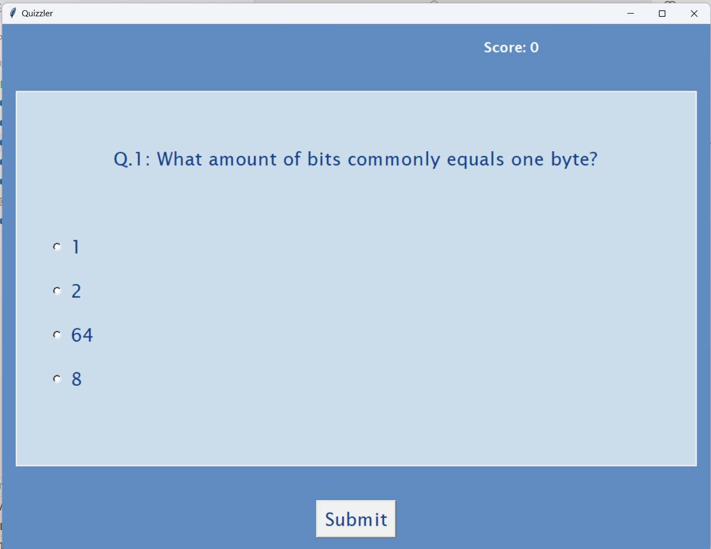
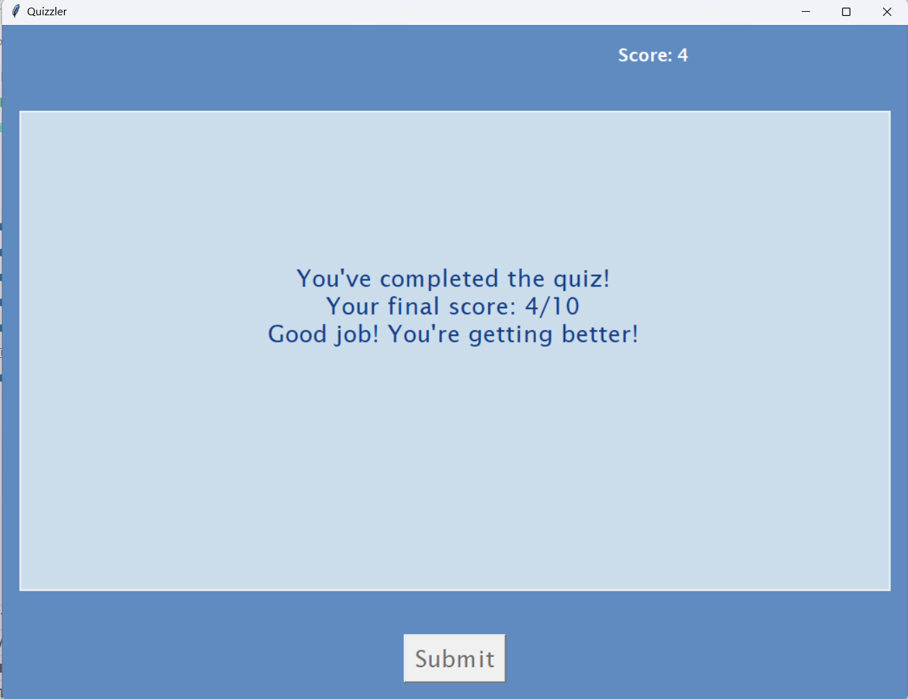
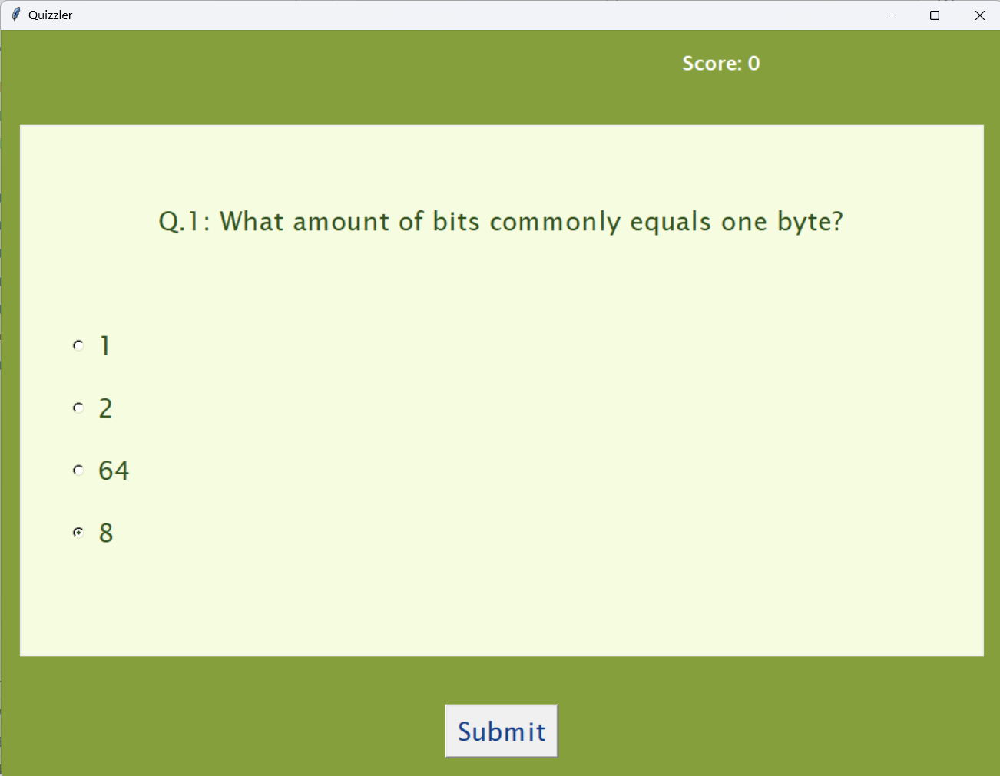
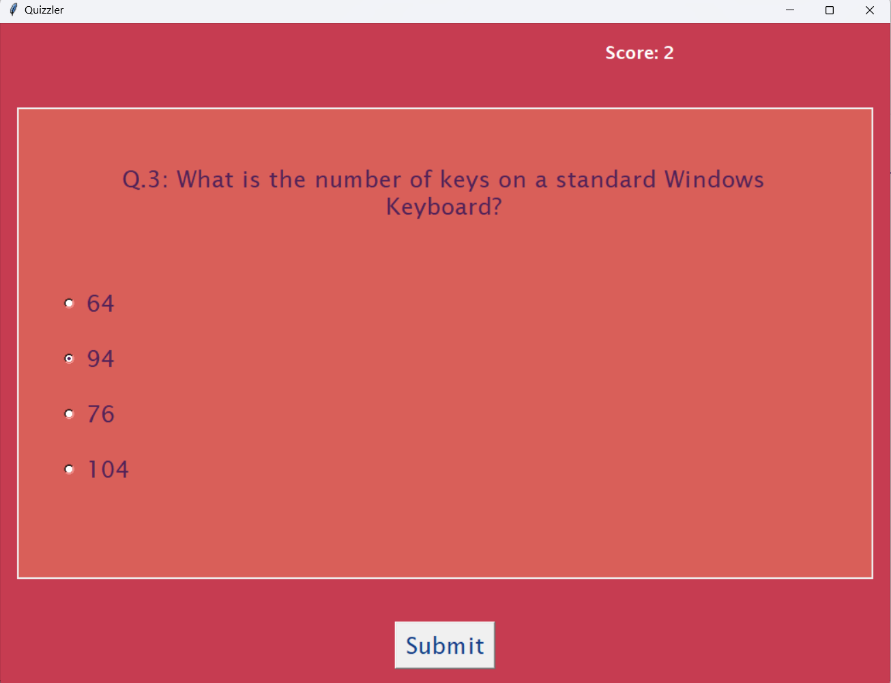

# 🧠 Quizzler - Python-Based Quiz Application

## 📌 Overview

**Quizzler** is a Python-based GUI quiz application that fetches trivia questions from an online API and challenges the user with a series of True/False questions. Built using **Tkinter**, the app demonstrates effective use of object-oriented programming, API integration, and interactive UI design in Python.

---

## 🎯 Objective

The primary goal of Quizzler is to:
- Provide a user-friendly quiz experience.
- Integrate with the Open Trivia DB API for dynamic question fetching.
- Showcase modular and scalable code architecture using Python.

---

## Screenshots

### Initial Screen and result
<table>
<tr>
<td></td>
<td></td>
</tr>
</table>

### Response to wrong or correct answer
<table>
<tr>
<td></td>
<td></td>
</tr>
</table>

---
## 🛠️ Tech Stack

| Component        | Technology         |
|------------------|---------------------|
| Language         | Python              |
| GUI Framework    | Tkinter             |
| Data Source      | Open Trivia DB API  |
| Architecture     | Object-Oriented     |

---

## 🧩 Project Structure

<pre>
quizzler/
│
├── main.py # Main file to run the application
├── ui.py # Handles the GUI logic with Tkinter
├── quiz_brain.py # Core logic for question handling
├── data.py # Module for API integration
└── README.md # Documentation
</pre>


- `main.py`: Initializes the quiz and GUI components.
- `ui.py`: Manages GUI rendering and button interactions.
- `quiz_brain.py`: Controls quiz logic, answer checking, and scorekeeping.
- `data.py`: Fetches quiz questions from the Open Trivia DB API.

---

## 🔌 API Integration

Questions are fetched using a GET request from the [Open Trivia Database API](https://opentdb.com/api_config.php). The app dynamically parses the JSON response and formats it for display.

Example API endpoint:
> https://opentdb.com/api.php?amount=10&type=boolean

 - You can adjust amount if you want more or less questions. And type also.

---

## 💻 How to Run

### ✅ Prerequisites

- Python 3.x installed on your machine
- `requests` library (install via pip)

### 🧪 Installation Steps

```bash
git clone https://github.com/prashantgohel321/Quizzler-Python.git
cd quizzler
pip install requests
```

### Execution
> python main.py

### Features
 - Clean and responsive UI with score tracking
 - Instant feedback with visual cues (color-based)
 - Real-time data fetching using API
 - Modular code architecture for scalability


