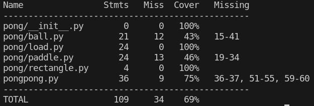
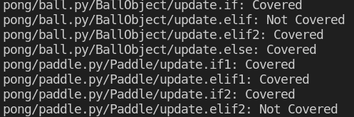
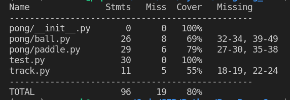
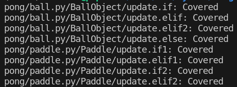

# Report for Assignment 1

## Project chosen

Name: Python

URL: <https://github.com/geekcomputers/Python>

Number of lines of code and the tool used to count it: <31401>

Programming language: <Python>

## Coverage measurement

### Existing tool

<Coverage.py>

### Your own coverage tool

<The following is supposed to be repeated for each group member>

<Francis>

BinaryExponentiation

<https://github.com/Timmermans13/Python/blob/Francis-Branch/power_of_n.py>

is_balanced

<https://github.com/Timmermans13/Python/blob/Francis-Branch/balance_parenthesis.py>

## Coverage improvement

### Individual tests

<The following is supposed to be repeated for each group member>

<Francis >

<Test 1: pow-test-one>

<https://github.com/Timmermans13/Python/blob/Francis-Branch/power_of_n.py>

<The test I have provided tests the with the branch where n is equal to 0 (pow-case-1). This was the only branch that was not covered, hence improving the branch coverage to 100%>

<Test 2: bal_case-two-test>

<https://github.com/Timmermans13/Python/blob/Francis-Branch/balance_parenthesis.py>

<The test I have provided tests the with the branch where the string empty (bal-case-2). This was the only branch that was not covered, hence improving the branch coverage to 100%>

<Connor>

Pre-test coverage

Pre-test branches

Post-test coverage

Post-test branches

Code added: track.py, test.py
Code modified: pongpong.py, ball.py, paddle.py

### Overall
Old cov:

Francis:

New cov:

Francis:

<Provide a screenshot of the new coverage results by running the existing tool using all test modifications made by the group>

## Statement of individual contributions

Francis: I have made coverage measurements of two functions and 
I have addedone test case for each function to improve the coverage.
