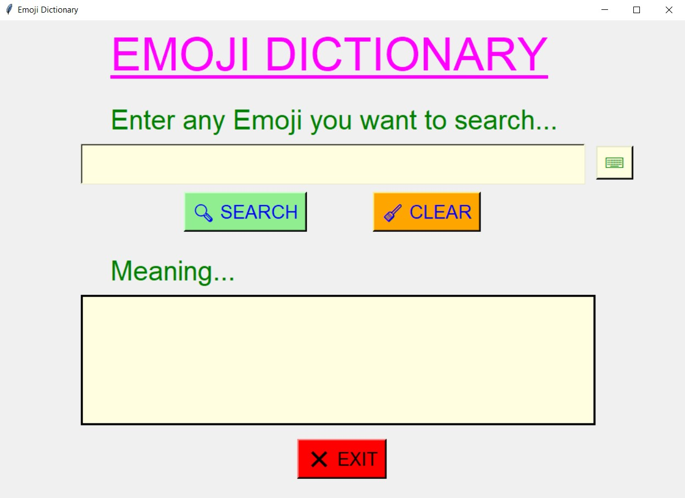
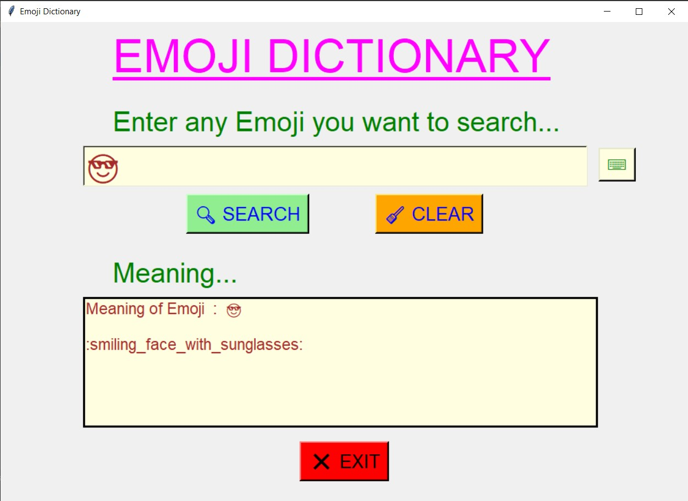

## ✔ EMOJI DICTIONARY
- An "Emoji Dictionary" created in python with tkinter gui.
- Using this dictionary, user will be able to search the meaning of any emoji user want yo search.
- Here user can also search the meaning of multiple emoji at a time.

****

### REQUIREMENTS :
- python 3
- tkinter module
- from tkinter messagebox module
- emoji

### How this Script works :
- User just need to download the file and run the emoji_dictionary.py on their local system.
- Now on the main window of the application the user will be able to see an entry box where user can enter any emoji using virtual keypad.
- After user has entered one or more emoji using the virtual keypad, when user clicks on the search button, user will be able to see the meaning of the emoji entered.
- Also if user has not entered emoji in input entry, and tries to search, he will get the error message like "You have entered no emoji".
- Also there is a clear button, clicking on which user can clear both the input and output area.
- Also there is an exit button, clicking on which exit dialog box appears asking for the permission of the user for closing the window.

### Purpose :
- This scripts helps user to easily get the meaning of any emoji.

### Compilation Steps :
- Install tkinter, emoji
- After that download the code file, and run emoji_dictionary.py on local system.
- Then the script will start running and user can explore it by entering any emoji and searching it.

### SCREENSHOTS :

   
   
   
   
   
   
   
   
   

****

### Name :
- Akash Ramanand Rajak
