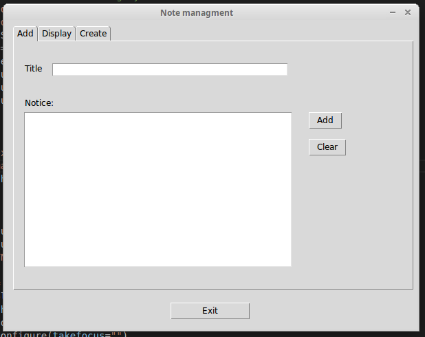

# Simple note managment

This app is a simple note managment (notepad). You can write notes and save it with a title. In addition you can pull previous notes back.
The app is writen in **python 2** and uses [Tkinter](https://docs.python.org/2/library/tkinter.html) as gui-librarie. Furthermore the UI was created with the gui-builder [PAGE](http://page.sourceforge.net/). The app uses the [Sqlite](https://www.sqlite.org/) database for managing the notes. 

### Dependencies

* Python 2 (2.7)
* Tkinter


### Start the app

You start the app with ```python notepad.py``` in the console or under Windows you double-click on ```notepad.py``` .
You can also use the executables in the **bin** directory.  

**Important:** You needed the file ```notepad_support.py``` !  

### Usage

First of all you must click on the **tab Create** then on the button **Create** for creating a new note management.  
You add new notes over the tab Add and displays the notes over the tab display. In the display-tab you must type the title or a keyword of the note that you will find.  

### How it looks like?

