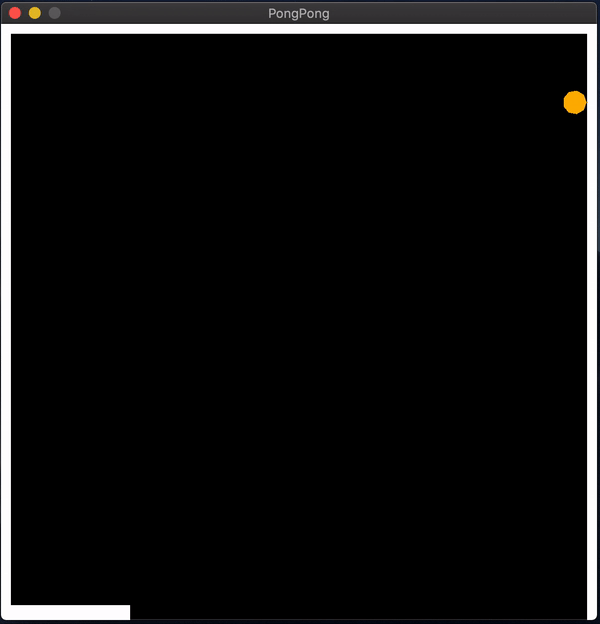

# PongPong

Are you just starting your Game Development journey ?

Do you want to learn something new ?

PongPong, a game that every developer should try their hands on !

I really enjoyed making this game when I went ahead and completed a task from Zero To Mastery Academy monthly challenge.

It was super fun learning something new, the basics of game development and how to view a game as just like a geometry plane to work with, was simply mind blowing for me.

I chose pyglet for development work, motivation behind this was to completely learn something new and not to work with the good old pygame !

Go through the following parts to get familiar with pyglet game development style:

1. [Making PONGPONG - Game Development using Pyglet - Part 1](https://blog.codekaro.info/making-pongpong-game-development-using-pyglet-part-1)
2. [Making PONGPONG - Game Development using Pyglet - Part 2](https://blog.codekaro.info/making-pongpong-game-development-using-pyglet-part-2)
3. [Making PONGPONG - Game Development using Pyglet - Part 3](https://blog.codekaro.info/making-pongpong-game-development-using-pyglet-part-3)

I really loved writing my experience and how I approached the problem, hoping you will find it insightful, will learn something new and get to know basics of developing a game like PongPong.

---

Library used:

**pyglet**

Install to your virtual environment or global using pip:

*pip install pyglet*

Game Play Demo on MacOS:

---

*Actual game was developed using Pygame shown in a youtube tutorial and can be found at [Pong, Python & Pygame](https://www.youtube.com/watch?v=JRLdbt7vK-E)*
